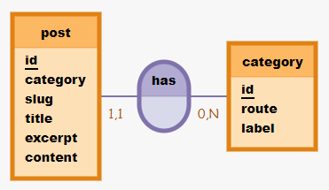
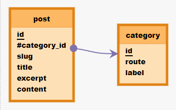
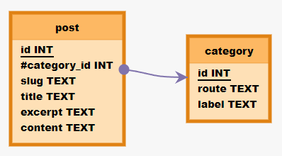

# API blog

---
---

## GET STARTED

Pré-requis :
- installer Node.js -> [Documentation Node.js](https://nodejs.org/fr/download/)
- installer PostgresSQL -> [Documentation PostgreSQL](https://www.postgresql.org/download/)
- installer Sqitch -> [Documentation Sqitch](https://sqitch.org/download/)

Procédure :
- Cloner le repo github
- Ouvrir le dossier dans VScode
- Lancer la commande `npm run initAPI` dans le terminal
- Attendre la fin du script et ouvrir l'url : http://localhost:3111/oblog-api

---
---

## 1. MCD - MLP - MPD

### MCD

- post : code_post, slug, title, excerpt, content
- has, 11 post, 0N category
- category : code_post, route, label



J'ai pris la liberté de modifier la structure des données afin de faire correspondre une clé étrangère dans la table `post` à un id de la table `category`. 

La colonne `category` présente actuellement et content une string sera remplacée par une colonne `category_id` qui contiendra une clé étrangère en `integer`.

En analysant les données fournies, je comprends qu'un article ne peux avoir qu'une seule catégorie. Pour simplifier la structure des données, et comme rien ne démontre qu'un article peut en avoir plusieurs, je pars sur une relation `post 1N category`. Si plus tard on souhaite faire en sort qu'un article puisse avoir plusieurs catégories, il faudra transformer cette relation en `NN` et donc passer par une table d'association. Après consultation des fronteux, ils considère que chaque article n'a qu'une seule catégorie, le temps passé à modifier la structure de la BDD si jamais on doit le modifier leur sera facturé !

### MLD

- post: id, #category_id->category->id, slug, title, excerpt, content
- category: id, route, label



### MPD

- post: id INT, #category_id INT->category->id INT, slug TEXT, title TEXT, excerpt TEXT, content TEXT
- category: id INT, route TEXT, label TEXT



## 2. Mise en place de la BDD

### sqitch

- Création du dossier [migration](./migration)
- `cd migration` puis `sqitch init oblog --engine pg --target db:pg:oblog`
- Création des fichiers [deploy.sh](./migration/deploy/deploy.sh), [revert.sh](./migration/revert/revert.sh), [verify.sh](./migration/verify/verify.sh) avec les identifiants de connexions
- Création de [init_db.sql](./migration/init_db.sql) qui crée le role et la base de donnée
- Création d'une version à partir du fichier [add_version.sh](./migration/add_version.sh) pour la création des tables

### seeding

- création du fichier [data/import.js](./data/import.js) pour le seeding des tables avec les données fournies

### Initialisation de la bdd

- lancer `npm run initDb` qui va utiliser le script [migration/init_db.sh](./migration/init_db.sh)

```shell
cd migration/
psql -U postgres -f init_db.sql
bash deploy/deploy.sh
bash verify/verify.sh
cd ..
node data/import_INSERT_SELECT.js
```

## 3. Mise en place de l'api

- Création de toute la structure, de l'index.js jusqu'au datamapper en séparant ce qui concerne les posts et les categories
- Création des routes et mise en place des regex sur les `req.params.id` pour autoriser uniquement les nombres et minimum 1
- Verification de la fonctionnalité des routes sur insomnia

exemple de route avec regex :
```js
postRouter.get('/posts/:id([0-9]+)', postController.getOne);
```

## 4. Typage des données

- Mise a jour de la version de la BDD avec sqitch via le fichier [add_version.sh](./migration/add_version.sh), avec la création de `DOMAIN` pour les colonnes `route` et `slug` qui ont un format particulier. J'ai estimé que les autres routes n'avaient pas besoin d'un format plus spécifique que les formats de base
- Création des [schemas JOI](./app/schema/) pour les body des routes post et patch, et du système de [validation](./app/service/validation.js)
```js
const categoryBodySchema = Joi.object({
  route : Joi.string().pattern(new RegExp('^/[a-z0-9]*$')),
	label : Joi.string()
}).required();
```
  - Intégration de la validation dans le router

```js
postRouter.post('/posts', validation.checkBody(postBodySchema), postController.create);
```

## 5. Gestion des erreurs

- Des erreurs peuvent être générées lors :
  - de la validation des schémas dans les routers
  - du try/catch dans les controllers
  - du 404 dans index.js
- Ces erreurs recoivent un status code et sont passés à la suite grâce au next(error)
- Elle sont ensuite récupérées par le middleware de gestions des erreurs dans [index.js](./index.js)
- Elles sont traitées par le service [errorHandling](./app/service/errorHandling.js) qui va les log dans le [dossier log](./logs/) à la racine

## 6. Documentation

- Mise en place de la documentation sur les routes
```js
/**
 * GET /posts
 * @summary Renvoi l'ensemble des posts
 * @tags posts
 * @return {post[]} 200 - liste des posts
 * @return {object} 500 - Unexpected error
 */
```
- Création de la doc swagger sur la route `/oblog-api`
- Mise en place de la JSdoc sur toutes les méthodes

## 7. ON DELETE CASCADE

J'ai réalisé les tests pour la mise en place ou non de la contrainte `ON DELETE CASCADE ` sur la foreign key category_id.

### Avec la contrainte ON DELETE CASCADE

- Si on met en place la contrainte ON DELETE CASCADE sur la foreign key category_id :
> Lors de la suppression d'une catégorie, il y a une suppression automatique de tous les articles liés

### Sans la contrainte

- SI on ne met pas la contrainte ON DELETE CASCADE sur la foreign key category_id :
>Il n'est pas possible de supprimer une catégorie tant qu'elle est rattachée à des articles. Il est nécessaire de modifier ou supprimer ces articles jusqu'au ce que plus aucun article de soit lié a cette catégorie, et seulement là il est possible de supprimer la catégorie

J'ai retenu cette solution pour plusieurs raisons :
- Selon moi, les données les plus importantes à sauvegarder sont les articles. Il est dangereux de laisser une possibilité d'une suppression de masse d'article aussi accessible. Un utilisateur, en voulant supprimer une catégorie, n'aura pas systématiquement la volonté de supprimer les articles liés à cette catégorie, et pourra effectuer cette action involontairement, dans le but de supprimer uniquement la catégorie. La perte pourrait être de très grande ampleur, et irréversible.
- Les catégories sont des thèmes très généraux. Il y a peu de chance qu'on soit ammené à modifier de manière aussi drastique une catégorie en souhaitant la supprimer, surtout si cette catégorie est reliée à un grand nombre de contenu. Il est très probable qu'on souhaite simplement modifier son nom, ou la supprimer si elle est vide, mais certainement pas la supprimer avec tout son contenu

## 8. INSERT SELECT

Refactorisation du fichier [data/import.js](./data/import.js) dans un nouveau fichier [data/import_INSERT_SELECT.js](./data/import_INSERT_SELECT.js) en remplacant la boucle dans la boucle par un INSERT SELECT bcp plus classe.
```js
for (const post of posts) {
    const sql = `
        INSERT INTO post (slug, title, excerpt, content, category_id)
        VALUES ($1, $2, $3, $4, (
            SELECT id
            FROM category
            WHERE label = $5
        ))`
    const values = [post.slug, post.title, post.excerpt, post.content, post.category];
    await client.query(sql, values);
}
```

## 9. Opérateur Ternaire

Utilisation d'un opérateur ternaire pour factoriser le if/else dans le fichier [validation](./app/service/validation.js).
```js
error ? ( error.code = 500, next(error) ) : next();
```
Clairement, c'est pas la plus importante factorisation, c'était plutot pour m'entrainer à la logique des ternaires et leurs utilisations avec plusieurs commandes. Cela permet d'avoir tout sur une seule ligne, rendant le code plus compact.

Mais malgré cela, il faut reconnaitre que l'utilisation d'un opérateur ternaire avec plusieurs commandes rend moins compréhensible le code.

## 10. switch/case

J'ai supprimé le switch case dans le fichier [errorHandling](./app/service/errorHandling.js) et remplacé par une ligne gérant l'ensemble des cas.
```js
return res.status(err.code).json(err.message);
```
Ce switch case ne gérait qu'un seul cas (404) différent du default. Et la seule différence ne résidait que dans le renvoit d'un status 404 ou 500. J'ai préféré l'enlever pour simplifier cette partie du code.

Pour que ça fonctionne, j'ai ajouté un status code à chaque erreur générée dans le reste du code. Cela permettra, sur n'importe quelle erreur qu'elle soit traitée de la même façon avec ses propres paramètres.
```js
error.code = 500;
next(error);
```

## 11. Index routers/controllers/datamappers

Création d'un index [controller.js](./app/controllers/controller.js) qui importe tous les controllers et les exporte depuis un seul endroit.
Cela permettra de faire l'importation des controllers dans les autres fichiers depuis un seul fichier.

Cette méthode est appliquée pour les routers dans [router.js](./app/routers/router.js) et les datamappers dans [datamapper.js](./app/datamappers/datamapper.js)

## 12. __dirname

Utilisation de la variable `__dirname` pour le log des erreurs dans le fichier [errorHandling](./app/service/errorHandling.js).

Nativement, cette variable `__dirname` n'est pas disponible avec la gestion en type module. On est obligé de la reconstruire grâce au package `path`, pour pouvoir créer la direction urtilisée par la fonction `appendFile` et ainsi cibler le dossier source de notre API.

Au départ, j'avais utilisé le chemin en dur `./logs/${filename}` qui fonctionnait. Mais je pense que lors d'un déploiement en dehors de mon hote, le chemin en dur risque de ne pas fonctionner. Cela nécessiterait des tests pour lesquels je n'ai pas encore les moyens techniques et les connaissances disponibles

## 13. Schémas JSDOC

Création des schémas JSDOC et intégration de ces schémas dans les paramètres des routes pour l'affichage dans swagger.
```js
/**
 * Détail d'un post
 * @typedef {object} post
 * @property {integer} id - id unique du post
 * @property {integer} category_id - numéro de catégorie
 * @property {string} slug - string utilisable dans l'url
 * @property {string} title - titre du post
 * @property {string} excerpt - résumé du post
 * @property {string} content - contenu du post
 */
```

## 14. Gestion des erreurs

J'ai ajouté des gestions d'erreurs dans le cas ou les `req.params.id` ne correspondent à aucun élément.

Avant, mettre un id au bon format regex mais qui ne correspond à rien en BDD renvoit une réponse vide et non pas une erreur. J'ai donc ajouté dans les controllers la possibilité" de créer une erreur dans ces cas là.

Le seul cas qui n'est pas encore géré, c'est la différenciation lors d'un appel à la route `/posts/category/:id` entre une catégorie qui n'existe pas et une catégorie qui est vide. Les deux renvoient la même réponse, un tableau vide, qui est donc interprété comme une erreur.

## 15. Dynamisation des routes PATCH

J'ai rendu dynamique les routes `PATCH` permettant de recevoir des objets contenant uniquement les données mises à jour. De cette manière, le FRONT n'est plus dans l'obligation de renvoyer l'ensemble des données d'un post ou d'une catégorie, et ne renvoit que les données qui ont été modifiées par l'utilisateur. On évite donc de devoir utiliser des ressources à réécrire des données qui n'ont pas été modifiées.

Par ailleurs, de cette manière il n'est plus possible de tout faire en une seule requête, il serait judicieux de tester les performances des deux solutions 

## A demander à Benjamin

- comprendre pourquoi la callback du appendfile dans errorHandling ne marche pas

## 16. CORRECTION

- Ajout d'une version [4.add_constraint_unique](./migration/deploy/4.add_constraint_unique.sql) à la BDD
- Modification de la version [3.delete_constraint_on_delete_cascade](./migration/deploy/3.delete_constraint_on_delete_cascade.sql) avec l'ajout de la priopriété `NOT NULL`
- Ajout d'un 3e script d'import, qui permet d'insérer l'ensemble des données en une seule requête pour les categories et une seule requête pour les posts
- mise à jour des méthodes Update des datamappers pour tout intégrer en une seule requête plutot qu'une requête par ligne du body.